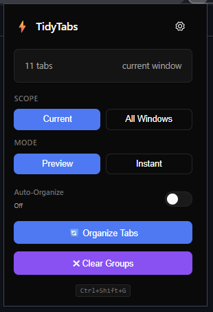
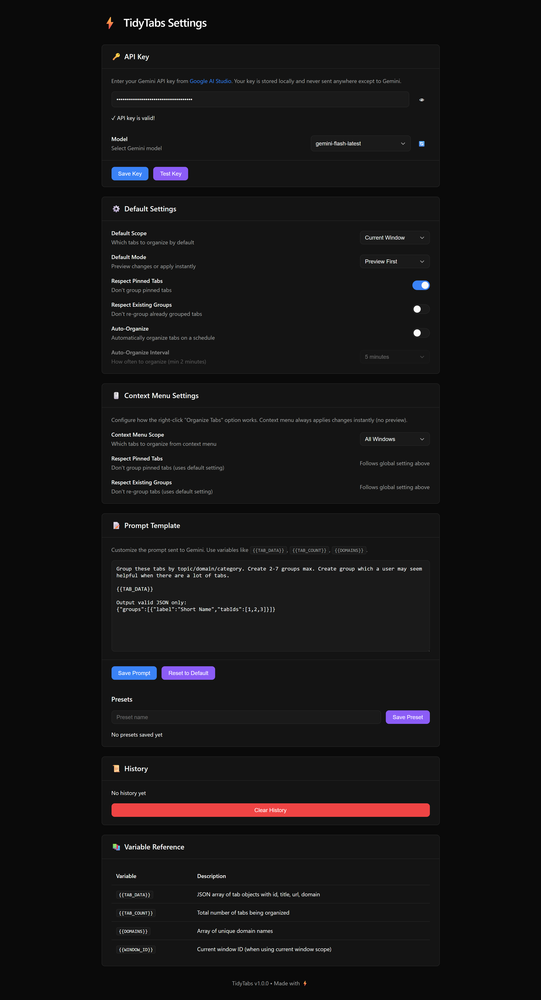

# TidyTabs

AI-powered browser tab organization using Google's Gemini API to intelligently group your tabs by topic, domain, and context.


## Key Features

- Privacy-focused: all data stays local, API key stored client-side
- Preview mode to review AI suggestions before applying
- Fully customizable prompts with variable templates
- AI-powered semantic grouping using Gemini API
- Dark mode UI with shadcn-inspired aesthetics
- Right-click context menu for quick access
- Auto-organize on scheduled intervals

## Usage


<h3>
<details>
<summary>Screenshots</summary>

1. Popup



2. Option Configuration



</details>
</h3>

## Technologies Used


## Installation

### Prerequisites

- Any Chromium-based browser (Chrome, Edge, etc.)
- Gemini API key from [Google AI Studio](https://aistudio.google.com/apikey)

### Download and Install

1. Go to the [Releases](https://github.com/SpreadSheets600/TidyTabs/releases) page of this repository.

2. Download the latest `.zip` file for your browser (e.g., `tidytabs-chromium-v1.0.0.zip`).

3. Unzip the downloaded file.

4. Open your browser and navigate to the extensions page:
   - Chrome: `chrome://extensions/`
   - Edge: `edge://extensions/`
   - Or any other chromium browser extensions page

5. Enable "Developer mode" (toggle in the top-right corner).

6. Click "Load unpacked" and select the unzipped folder.

7. The TidyTabs extension should now be installed.

### Configuration

1. Click the TidyTabs extension icon in the browser toolbar.

2. Click the settings icon (gear) to open options.

3. Enter your Gemini API key.

4. Click "Save Key" and "Test Key" to verify the connection.

## Roadmap

- [ ] Analytics dashboard for tab organization patterns
- [ ] Support for additional AI models (Claude, GPT-4)
- [ ] Export/import preset configurations
- [ ] Tab search and filter within groups
- [ ] Undo/redo group operations
- [ ] Firefox extension port

## Contributing

For developers who want to contribute code:

1. Clone the repository:

   ```bash
   git clone https://github.com/SpreadSheets600/TidyTabs.git
   cd TidyTabs
   ```

2. Install dependencies:

   ```bash
   npm install
   ```

3. Start development mode:

   ```bash
   npm run dev
   ```

4. Build for production:

   ```bash
   npm run build
   ```
